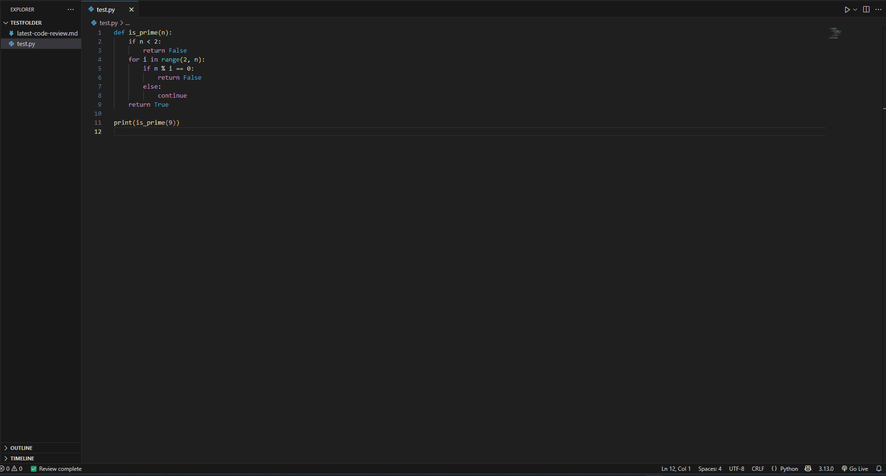

# 🧠 CodeReviewerMax

Local AI Code Reviewer for Visual Studio Code

CodeReviewerMax is a free, fully offline AI-powered code review extension for VS Code. It lets you select code in the editor and instantly get AI-generated feedback focused on readability, logic, and improvements — without needing any API keys or internet access.

Powered by GPT4All running locally on your machine.
---

## 🎥 Demo



---

## 🚀 Features

- 🧠 AI-generated code reviews based on selected code
- ✍️ Concise, professional feedback (not verbose)
- 📑 Markdown-rendered feedback in a clean side panel
- 💾 Automatically saves `latest-code-review.md` in your workspace
- 🖱️ Trigger with command or shortcut: `Ctrl + Alt + R`
- ✅ Fully offline (powered by GPT4All and local Flask backend)
- 💬 Status bar shows progress while reviewing

---

## ⚙️ Requirements

- **VS Code 1.99.0+**
- **Node.js** (for building extension)
- **Backend AI API running on** `http://localhost:4891`

You can run on:
- 🧠 [GPT4All App with Local Server](https://gpt4all.io/)
---

## 📦 Getting Started

1. Clone this repo  
2. Run `npm install`  
3. Run `npm run compile`  
4. Press `F5` to launch a Development Host  
5. Select code in an open file  
6. Press `Ctrl + Alt + R`  
7. View review in side panel and in `latest-code-review.md`

---

## 🧪 Optional Flask Backend

You can use the [CodeReviewer Flask server](https://github.com/your-backend-repo-link) to run models like CodeT5+ or StarCoderBase locally.

---

## 🛠️ Building / Packaging

```bash
npm run compile       # Compile the extension
vsce package          # (Optional) Create VSIX package for publishing
